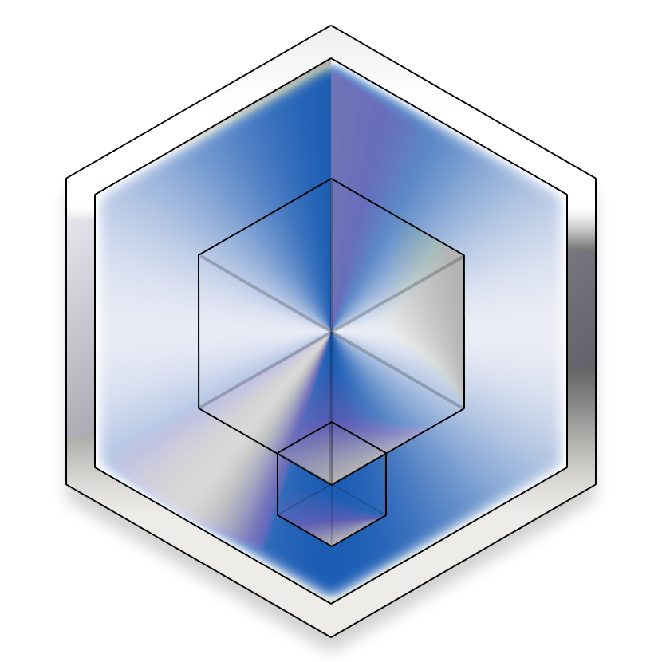

# Web Projects Initiatives - Symfony Project Template

_Warning: this project template is only designed to work with Windows 10 so far._  
_*nix contributions are welcome!_

## This project aims at setting up a new, opinionated web project complete architecture instantly via Docker.

### Purpose 

This project came online after noticing a growing need of industrialization 
of the web projects where its core maintainers were working.

The purpose of this repository is the following:
- Be easy to set up: clone, RTFM, start with abstract, shell-based, simple commands, customize if needed
- Offer a snap-your-fingers-to-start series of environments: `dev`, `qa` and `prod`. 
  You pick up which one corresponds to your working chain *(local, tests, QA, preprod, etc.)*!
- Use Docker in all environments, and in production (for better industrialization)
- Offer a typical, **opinionated** stack of tools that can be trimmed from it, if estimated unnecessary
- The default stack is: 
  - **MySQL** / **PostGreSQL** as a **RDBMS**
  - **PHP + PHP-FPM** as a backend host, embedding a fully-working, ready-to-go **Symfony** shell
  - **NginX** as a **web server** in **ALL** environments (but you can still use the Symfony installer / launcher if you want)
  - **VarnishCache** as a **reverse proxy**, bypassing everything in `dev``, but actively caching on all other environments.
  - **MailCatcher** as an **email-testing** service
  - **HAProxy** as a load balancer, statically bound to pick up at random a chain of all the components above 
    out of two of them  


### Philosophy

This is **not** a functionality-filled project *per se*, it's rather **a shell to extend when starting a new one**.

It is based on a directory structure that allows other projects to run simultaneously on the same machine.

It lays new projects expected standards, among which:
- a Clean Architecture-oriented directory tree
- Clean Architecture-oriented naming
- Clean Coding-inspired sources
- an industrialization shell for projects
- the future addition of quality and automatization tools

Upon the first start, it only serves a simple _"Hello world!"_, through the stack mentioned above.

It lays the basics to set up three working environments: `dev`, `qa` and `prod`.
But those can be easily extended, you just need to copy/paste all the files/directories that bear such labels
and Search/Replace all their contents! 

### Setup

The setup is lightning fast, you just have to replace...

- `[new-project-template]` with your slugified project name, for example `my-project`.
- `localfakedomain` with the fake local domain name you want to use in your browser, like `mydomain`, for instance
- `dummyextension` with the fake local TLD name you want to use, like `local`, for instance (`mydommain.local`...)

...in:

- the **file names**
- the file **contents**

(basically, `Ctrl+Shift+N` to search for file names and `Ctrl+Shift+R` to replace contents in PHPStorm with default keymaps)

Then, under Windows 10, in a shell, call:

```shell script
"bin/init-project.bat"
```
That command builds up the project basic missing structure on your machine (only needed on your local computer)

```shell script
"bin/build-all-docker-containers.bat"
```

Then, if you need it, just copy the contents of directory `git-hooks-sources` to your current `.git/hooks` directory.
This is only useful if you intend to enforce `git commit` constraints.

Then modify your hosts file (usually `C:\Windows\System32\drivers\etc\hosts` or `/etc/hosts`) as follows, 
replacing the tokens here with the choices you made above:

```
    # Local URLs -- routed to respective environments
    # "prod" environment on local devices
    127.0.0.1 prod.[new-project-template].localfakedomain.dummyextension
    127.0.0.1 cdn.prod.[new-project-template].localfakedomain.dummyextension
    # "qa" environment on local devices
    127.0.0.1 qa.[new-project-template].localfakedomain.dummyextension
    127.0.0.1 cdn.qa.[new-project-template].localfakedomain.dummyextension
    # "dev" environment on local devices
    127.0.0.1 dev.[new-project-template].localfakedomain.dummyextension
    127.0.0.1 cdn.dev.[new-project-template].localfakedomain.dummyextension
```

And then you just have to type in your browser (replacing the tokens here with the choices you made above):

`http(s)://[env].[new-project-template].localfakedomain.dummyextension:101[env-number]1`

With \[env-number] being (look at the appropriate docker-compose files):

* prod: 0
* qa:   1
* dev:  2

*Note:*
This project explicits all containers virtual internal IP addresses and TCP ports 
instead of using Docker auto networking.
This requires users to do this for all similar, concurrently-running projects, 
but it has the advantage of offering 100% copy/paste URL + ports between
any person working in the project (especially during Docker setup).

### 🌲 The directory tree (as expected and generated by `init-project.bat`)

```
    + [Your project name, root directory]
    |
    |---+ /devops-sources
    |   |
    |   +--- Here you can put everywhere linked to continuous quality and integration (analysis, formatting, auto-fixing, ...)
    |   +--- ...
    |
    |---+ /docker-sources -- your docker sources
    |   |
    |   +---+ /containers-config
    |   |   |
    |   |   +---+ /[technology]
    |   |   |   |
    |   |   |   +---+ /[dev]-[technology]
    |   |   |   |   |
    |   |   |   |   +--- dev-[technology]-container-config.docker
    |   |   |   |   +--- ... plus any other necessary files to set up development
    |   |   |   |
    |   |   |   +---+ /[qa]-[technology]
    |   |   |   |   |
    |   |   |   |   +--- qa-[technology]-container-config.docker
    |   |   |   |   +--- ... plus any other necessary files to set up qa
    |   |   |   |
    |   |   |   +---+ /[prod]-[technology]
    |   |   |   |   |
    |   |   |   |   +--- prod-[technology]-container-config.docker
    |   |   |   |   +--- ... plus any other necessary files to set up prod
    |   |   |
    |   |   +---+ /[another technology]
    |   |       |
    |   |       +--- ...
    |   |
    |   +--- dev-docker-compose.yaml -- your docker-compose sources for each environment
    |   +--- global-docker-compose.yaml
    |   +--- prod-docker-compose.yaml
    |   +--- qa-docker-compose.yaml
    |
    |---+ /environment-files -- all your local environment files, shared between Docker and the containers technologies
    |   |
    |   +--- .env -- the global key/values for all your containers on all environments
    |   +--- .env.[environment].local-dist -- your local template to create local .env files
    |   +--- .env.dev -- one for each environment
    |   +--- .env.qa
    |   +--- .env.prod
    |
    |---+ /git-hooks-sources -- this directory contains the sources of what you should put into your git `.git/hooks` directory
    |   |
    |   +--- commit-msg
    |   +--- commit-msg.bat
    |   +--- pre-commit
    |   +--- pre-commit.bat
    |
    |---+ /ci-jobs
    |   |
    |   +--- Here you can put any backup of your CI integration jobs and tasks (better save them than sorry ^^)
    |
    |---+ /readme-sources
    |   |
    |   +--- Here you put whatever files `README.md` uses
    |
    +--- .dockerignore
    +--- .gitignore
    |
    +--- init-project.bat -- initalizes or reapplies project basic configuration
    +--- build-all-docker-containers.bat
    +--- build-dev-docker-containers.bat
    +--- build-qa-docker-containers.bat
    +--- build-prod-docker-containers.bat
    |
    +--- README.md
```

### Git

The `git commit` hook checks your commit messages to be formed as follows:

    [EXAMPLE-1111] example
    [devops] example
    WIP: example

Don't forget to add further git hooks if need and to save them here.

### 🐳 Docker

Everything lies in the `docker-sources` directory. You'll find explained and detailed
Dockerfiles. Don't forget to keep their verbosity.

To set up all containers and start the app, just use:

     build-all-docker-containers.bat

Or any other one if you just want to rebuild and start one environment at a time.

### Special thanks

Also, special thanks to Aurélien Tricard (@AurelienTRICARD) for the initial setup and the work on this project.
